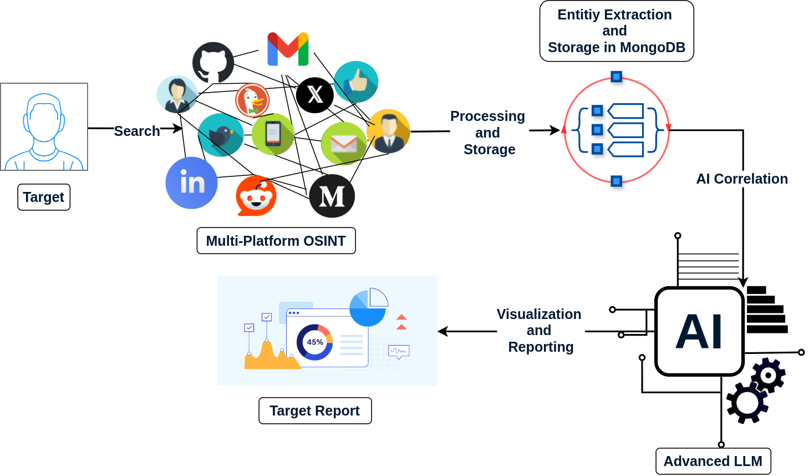
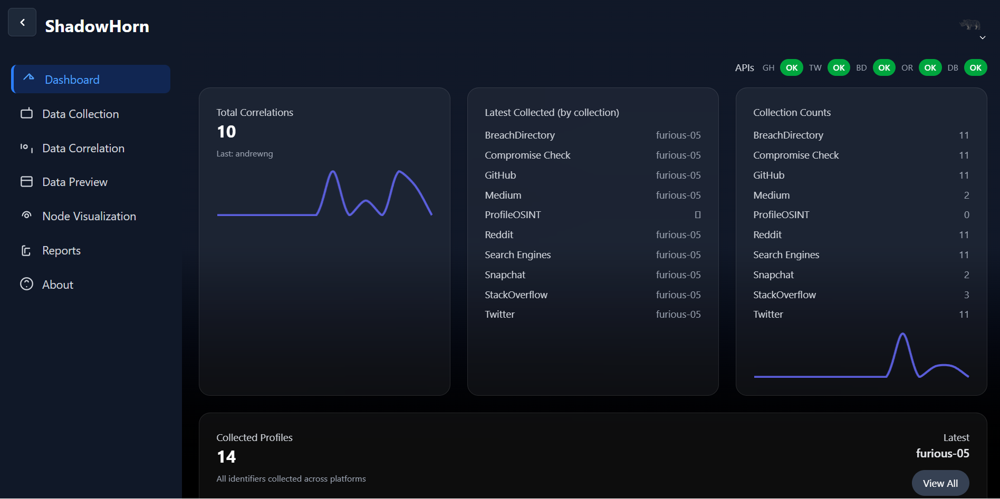
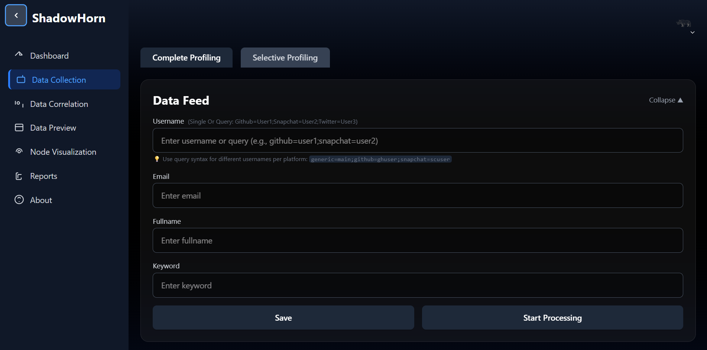
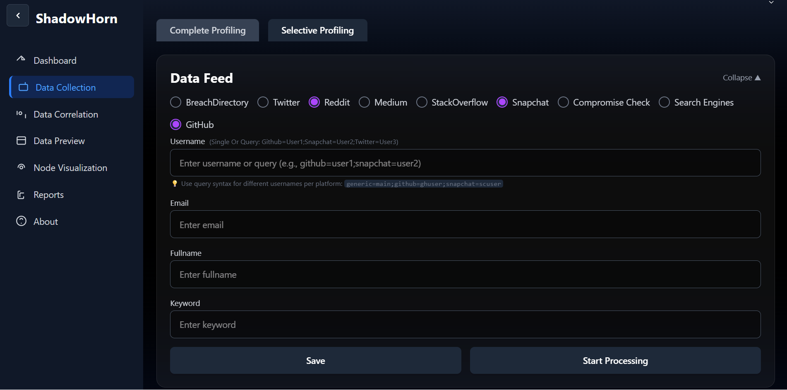
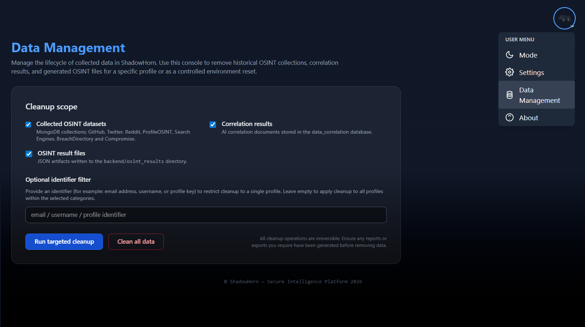
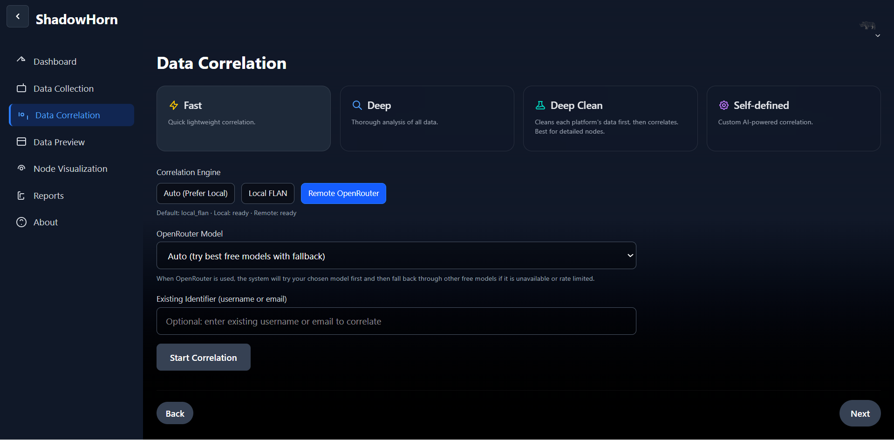
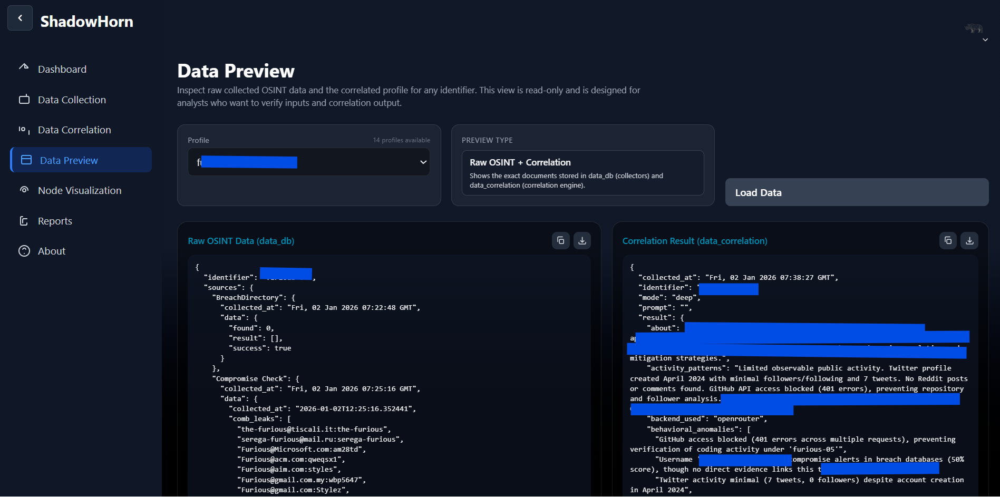
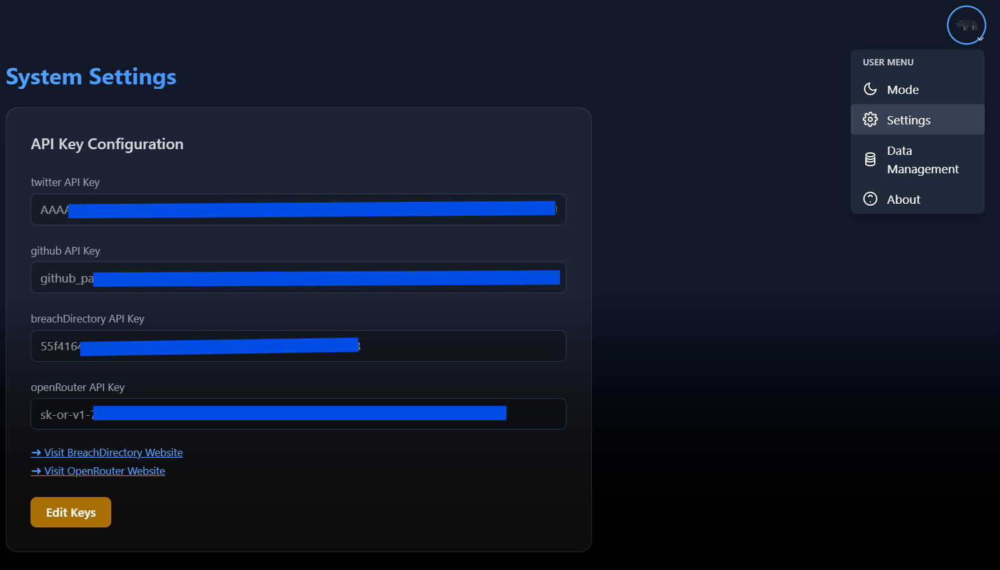

<div align="center">
  
  
  # ShadowHorn
  
  **Advanced Open Source Intelligence & Threat Analysis Platform**
  
  [](https://opensource.org/licenses/MIT)
  [](https://www.python.org/)
  [](https://react.dev/)
  [](https://vitejs.dev/)
  [](https://www.mongodb.com/)
  [](https://discord.gg/AxBskSe5Yb)

  <p align="center">
    <a href="#-about">About</a> •
    <a href="#-features">Features</a> •
    <a href="#-configuration">Configuration</a> •
    <a href="#-installation">Installation</a> •
    <a href="#-usage">Usage</a> •
    <a href="#-contributing">Contributing</a> •
    <a href="#-community">Community</a>
  </p>
</div>

---

## 🛡️ About

**ShadowHorn** is a next-generation OSINT (Open Source Intelligence) platform designed for security researchers, investigators, and threat analysts. It combines powerful data collectors with AI-driven correlation to uncover hidden connections across the digital landscape.

Built with a modern **React** frontend and a robust **Python Flask** backend, ShadowHorn provides a seamless experience for gathering, analyzing, and visualizing intelligence data from multiple sources including social media, code repositories, and breach databases.

ShadowHorn itself is completely free to use, and its core data collection and correlation pipeline is built around free‑tier APIs. You can go from first collection to AI correlation without paying for external services (optional breach‑directory lookups can use provider billing if you choose to enable them).

<div align="center" style="background:white; padding:12px; border-radius:8px; margin: 20px 0;">
  
</div>

## 🚀 Features

ShadowHorn is organized into intuitive modules to streamline your intelligence workflow:

### 📊 Dashboard
The command center of your operations. View real-time system status, active collectors, database statistics, and recent activity logs. Get a high-level overview of your current investigation targets.



### 📡 Data Collection
A powerful suite of collectors to gather raw intelligence from a single subject (username / email / full name).

**What it collects**
- **Social Media**: Snapchat, Twitter/X, Reddit, LinkedIn.
- **Code Repositories**: GitHub user and repository analysis.
- **Search Engines**: DuckDuckGo and Google‑style dorks.
- **Breach Data**: Integration with breach directory and compromise‑check APIs.

**How to use it best**
- Use **Complete Profiling** when you want all platforms; use **Selective Profiling** when you only care about a few.
- If you only know a **username**, paste it into **Username**, and (optionally) reuse it in **Fullname** and **Keyword** so search engines and Medium have input.
- If you have email, full name, and keywords, fill **all fields** – collectors will use everything you provide.
- For different handles per platform, use query syntax in **Username**, e.g. `generic=main;github=ghuser;snapchat=scuser`.

*Collectors support multi‑threading and proxy‑friendly operation for stealthier runs.*

**Collection views**




### 💾 Data Management
Safely clean up stored OSINT data when an investigation is finished.
- **Targeted cleanup**: Remove collected OSINT, correlation results, and OSINT result files for a single profile by providing an identifier (email / username / profile key).
- **Scoped categories**: Choose which layers to wipe (MongoDB OSINT collections, correlation documents, and JSON files under `backend/osint_results`).
- **Global reset (protected)**: Use the "Clean all data" button and type `clean all data` to perform a full environment reset; this action is irreversible, so export any reports you need first.



### 🧠 Data Correlation
The brain of ShadowHorn.
- **AI Analysis**: Uses OpenRouter/OpenAI models to analyze patterns in collected data.
- **Identity Resolution**: Correlates usernames, emails, and aliases across different platforms.
- **Deep Clean Mode**: Advanced filtering to remove noise and false positives.

**Models used for correlation (via OpenRouter, configurable in Settings):**
- **TNG: DeepSeek R1T2 Chimera (free)** – long‑context reasoning MoE with strong cost‑to‑intelligence trade‑off.
- **Nex AGI: DeepSeek V3.1 Nex N1 (free)** – agent‑oriented model, very good at coding, tools, and HTML/UI tasks.
- **TNG: DeepSeek R1T Chimera (free)** – blends DeepSeek R1 reasoning with V3 efficiency for general analysis.
- **DeepSeek: R1 0528 (free)** – original high‑reasoning R1‑style model with open chain‑of‑thought tokens.
- **OpenAI: gpt‑oss‑120b (free)** – large MoE model for heavy reasoning and agent workflows on H100‑class GPUs.
- **OpenAI: gpt‑oss‑20b (free)** – smaller MoE tuned for lower‑latency, single‑GPU and edge deployments.

These models are exposed in the UI so you can select your preferred correlation model directly on the Data Correlation page before running analysis.

If you don’t want to use OpenRouter at all, you can instead point the backend to a local FLAN‑based model for basic/offline correlation, but the OpenRouter path is recommended for the best reasoning quality and overall experience.



### 🔍 Data Preview
Lightweight viewer for what has been collected and correlated.
- Inspect raw OSINT JSON per platform.
- Inspect the correlation document that feeds Reports and Node Visualization.



### 🕸️ Node Visualization
Interactive graph visualization powered by Cytoscape.
- **Visual Links**: See connections between profiles, emails, and domains.
- **Platform Icons**: Visual indicators for Snapchat, Twitter, GitHub, etc.
- **Interactive Graph**: Drag, zoom, and explore the relationship network.
- **Styling**: Custom node styles for "Interest", "Timeline", and "Identity" nodes.


### 📝 Intelligence Reports
Generate professional-grade reports for stakeholders.
- **AI Narratives**: Automated threat assessment and executive summaries.
- **Export**: Download as high-quality PDF or JSON.
- **Risk Scoring**: Automated risk level assessment based on findings.


### ⚙️ Settings
Configure your environment.
- **API Keys**: Manage keys for OpenRouter, Twitter, and other services.
- **Theme**: Toggle between visual themes.
- **System Config**: Adjust collector timeouts and thread limits.



#### API Settings (all free except BreachDirectory)

ShadowHorn is designed to run on free API tiers where possible:
- **GitHub API (free)** – used to collect repositories and activity.
- **Twitter/X API (free tier)** – used to read public tweet/profile data.
- **OpenRouter API (free tier)** – used for AI correlation and reporting.
- **BreachDirectory API (paid)** – breach lookup service billed by the provider.

Only **BreachDirectory** requires a paid subscription; the others can be used on free tiers (subject to their limits).

**How to get each key**
- **GitHub**: Sign in to GitHub → go to **Settings → Developer settings → Personal access tokens** → create a token (read‑only scope is enough) → paste it into **github API Key**.
- **Twitter/X**: Visit [developer.twitter.com](https://developer.twitter.com) → create a **Project & App** → in the Keys & Tokens tab, copy the **Bearer Token** → paste it into **twitter API Key**.
- **BreachDirectory**: Open the BreachDirectory listing on [RapidAPI](https://rapidapi.com/rohan-patra/api/breachdirectory) → sign up and subscribe to a plan → copy your **X‑RapidAPI‑Key** from the dashboard → paste it into **breachDirectory API Key**.
- **OpenRouter**: Go to [openrouter.ai](https://openrouter.ai) → sign in and open **API Keys** → create a new key → paste it into **openRouter API Key** on the Settings page. If you get stuck generating the key, you can follow this short walkthrough video: https://youtu.be/Azkyhcxc1cE?si=uhW1wIuEiNxEW_c6.

---

## 🔧 Configuration & Environment

- **MongoDB** – the backend connects to a local MongoDB at `mongodb://localhost:27017/` and creates its databases automatically.
- **API keys** – Twitter, GitHub, BreachDirectory, and OpenRouter keys are stored via the **Settings → API Key Configuration** page in MongoDB; you configure them from the UI, not via environment variables.

There are two Python requirements files for the backend:

- `requirements.txt` – core backend dependencies (OpenRouter-only; no local FLAN).
- `req.txt` – optional extras for the local FLAN correlation backend.

If you only plan to use **OpenRouter**, just install `requirements.txt`. If you want to enable **local FLAN**, install both:

```bash
pip install -r requirements.txt
pip install -r req.txt
```

For reference, the core backend requirements (`requirements.txt`) are:

```text
# Core Flask Dependencies
Flask>=3.1.0
flask-cors>=6.0.0

# HTTP & Network
requests>=2.30.0
urllib3>=2.0.0
aiohttp>=3.9

# Web Parsing
beautifulsoup4>=4.12.0
lxml>=4.9.0

# Database
pymongo>=4.0

# AI/API
openai>=1.0

# Utilities
nest_asyncio>=1.5.0
click>=8.0.0
Jinja2>=3.0.0
MarkupSafe>=3.0.0
itsdangerous>=2.0.0
Werkzeug>=3.0.0
certifi>=2025.0.0
charset-normalizer>=3.0.0
idna>=3.0
blinker>=1.0

# PDF Generation
reportlab>=4.0.0

torch
transformers
```

The local FLAN extras (`req.txt`) are:

```text
torch
transformers
```

---

## 💻 Installation

### Prerequisites
- **Python** 3
- **Node.js** 18 or higher
- **MongoDB** (Local or Atlas)
- **Git**

### 🪟 Windows Setup

1.  **Clone the Repository**
    ```powershell
    git clone https://github.com/furious-05/ShadowHorn.git
    cd ShadowHorn
    ```

2.  **Backend Setup**
    ```powershell
    cd backend
    python -m venv venv
    .\venv\Scripts\Activate
    pip install -r requirements.txt
    ```

3.  **Frontend Setup**
  Open a new terminal in the root directory and install frontend dependencies (including Vite):
  ```powershell
  npm install
  ```

### 🐧 Linux / macOS Setup

1.  **Clone the Repository**
    ```bash
    git clone https://github.com/furious-05/ShadowHorn.git
    cd ShadowHorn
    ```

2.  **Backend Setup**
    ```bash
    cd backend
    python3 -m venv venv
    source venv/bin/activate
    pip install -r requirements.txt
    ```

3.  **Frontend Setup**
  Open a new terminal in the root directory and install frontend dependencies (including Vite):
  ```bash
  npm install
  ```
---

## 🕹️ Usage

To start ShadowHorn you need the backend API and the frontend UI running.

### 1. Start the backend API

**Windows (PowerShell)**
```powershell
cd backend
./venv/Scripts/Activate.ps1
python app.py
```

**Linux / macOS (bash/zsh)**
```bash
cd backend
source venv/bin/activate
python app.py
```

### 2. Start the frontend (all platforms)

On first run, install dependencies (this also pulls Vite):
```bash
npm install
```

Then start the development server:
```bash
npm run dev
```

Then open `http://localhost:5173` in your browser and, on first launch, go to **Settings → API Key Configuration** to paste your Twitter, GitHub, BreachDirectory, and OpenRouter keys before running collections or correlations.

---

## 🧭 Page‑by‑Page Walkthrough

This section explains how to practically use each page in a normal investigation flow.

### 1. Login
- Go to `http://localhost:5173` and sign in via the simple login screen.
- After the first successful login, the session is kept inside the running browser tab.

### 2. Dashboard
- Shows overall health of the collectors and backend (API status pills for GitHub, Twitter, etc.).
- Displays quick metrics for:
  - Total correlations, total collections, and total profiles.
  - Recent collection activity and 14‑day trend chart.
- Use the **Next** button in the footer to move directly into **Data Collection** once your APIs show as **OK**.

### 3. Settings
- Open **Settings** before your first run and fill API keys:
  - `Twitter` and `GitHub` tokens (optional but recommended).
  - `BreachDirectory` and `OpenRouter` keys if you use breach and AI features.
- Click **Save & Lock** to store your keys in MongoDB and avoid accidental edits.
- You can unlock, adjust, and re‑lock keys later if needed.

### 4. Data Collection
This is where you gather OSINT for a single subject (username / email / full name).

- Choose a **tab**:
  - **Complete Profiling** – enables all platforms by default.
  - **Selective Profiling** – lets you turn individual platforms on/off.
- Fill at least one of:
  - **Username** (e.g., `furious-05`).
  - **Email** or **Full Name** for broader discovery.
- Select platforms (GitHub, Twitter, Reddit, Medium, StackOverflow, Snapchat, Search Engines, BreachDirectory, Compromise Check).
- Click **Start Processing**:
  - A processing modal appears with a video loader (dark/light depending on theme).
  - Status messages show which platform is currently running.
- When finished, the collected data is stored in MongoDB and JSON files under `backend/osint_results`.
- Use the footer buttons to go **Back** to Dashboard or **Next** to **Data Correlation**.

**Query formats supported:**
- **Simple username** – just type a value, e.g. `furious-05`; ShadowHorn will reuse it across all selected platforms.
- **Per‑platform query** – use `platform=username` pairs separated by `;`, for example:
  - `Generic=furious-05;snapchat=furious.snap;reddit=furiousR`
  - Valid platform keys include: `github`, `twitter`, `reddit`, `medium`, `stackoverflow`, `snapchat`, `breachdirectory`, `compromise`, `searchengines`, `profileosint`, and `generic`.

**Recommended input pattern:**
- If you only know a **username**, paste it into **Username**, then also copy it into **Fullname** and **Keyword** so search‑engine and Medium collectors have something to work with.
- If you know more (email, full name, keywords), fill **all fields** – collectors and correlation will combine everything.
- Use the per‑platform query syntax only when a subject uses different handles per platform and you want precise control.


### 5. Data Correlation (how to use properly)
This page turns raw OSINT into a unified intelligence picture.

Steps:
- Pick an **Existing Identifier** from the dropdown (the profile you collected earlier).
- Choose **Correlation Mode**:
  - **Fast** – cheaper/quick summary using less context.
  - **Deep** – full context across all platforms (recommended for final reports).
- Choose **Backend & Model**:
  - Backend: `auto` (ShadowHorn selects), `local_flan`, or `openrouter`.
  - Model: `auto` or a specific OpenRouter model if you configured one.
- (Optional) Enter a **Custom Prompt** to steer the analysis (e.g., “Focus on credential exposure and attack surface”).
- Click **Run Correlation**:
  - A processing overlay appears; backend aggregates all OSINT and calls the AI model.
  - On success, the merged profile and correlation summary are saved to the correlation database.

Best practice:
- Always verify that **Data Collection** has run recently for the identifier.
- Use **Deep mode** for final investigations; keep **Fast mode** for quick triage.

Supported OpenRouter models (see `AllModels.md` for full details):
- **TNG: DeepSeek R1T2 Chimera** – fast, long‑context reasoning for deep investigations.
- **Nex AGI: DeepSeek V3.1 Nex N1** – strong for coding, tooling, and agent‑style workflows.
- **TNG: DeepSeek R1T Chimera** – balanced general‑purpose reasoning model.
- **DeepSeek: R1 0528** – original high‑reasoning R1 checkpoint.
- **OpenAI: gpt‑oss‑120b** – heavy reasoning MoE for complex cases.
- **OpenAI: gpt‑oss‑20b** – lighter MoE for faster or resource‑limited runs.

### 6. Node Visualization
Graph view of the correlated profile.

- Select a profile from the **Select Profile** dropdown.
- If you see a “No correlation yet” message, click **Run Deep Correlation Now** directly from this page.
- Once a graph is loaded:
  - **Pan/Zoom** with mouse or trackpad.
  - **Click a node** to open the right‑hand **Node Details** panel:
    - Shows platform, handle, bio, location, metrics, compromise flags, and links.
  - Node shapes and borders indicate type (user, repository, interest, description, location, etc.).
- The **Intelligence Summary** panel on the top‑right displays the same AI narrative you see on the Reports page in compact form.

### 7. Data Preview
- Lets you inspect **raw OSINT JSON** and **correlation documents** for a chosen identifier.
- Pick an identifier, then choose "OSINT Data" or "Correlation Result".
- Click **Load Data** to view prettified JSON with syntax‑highlight‑style layout (depending on theme).
- Useful for debugging collectors and verifying what exactly went into the AI pipeline.

### 8. Intelligence Reports
Produces human‑readable PDF‑style reports.

- Select an identifier from the dropdown.
- Click **Generate Comprehensive Report**:
  - Backend calls `comprehensive_report.py` and AI to assemble sections like Overview, Attack Surface, Breach Findings, Timeline, and Recommendations.
- Use the section list on the left to expand/collapse individual report blocks.
- Click **Download PDF** to generate a shareable report file.
- Use the footer buttons to go back to **Node Visualization** or return to **Dashboard**.

### 9. Data Management
Controls cleanup of stored data.

- Choose what to clean:
  - **Collected OSINT datasets** (Mongo collections).
  - **Correlation results**.
  - **OSINT result files** on disk.
- (Optional) enter an **Identifier filter** to target only one profile.
- Click **Run targeted cleanup** to clear just the selected types / identifier.
- For a full wipe, click **Clean all data**:
  - A centered confirmation modal appears.
  - Type `clean all data` exactly, then press **OK**.
  - This permanently clears all selected datasets.

### 10. About
- Static page describing ShadowHorn’s purpose, capabilities, and intended users.
- Helpful for onboarding new analysts or stakeholders to the platform.

---

## 🛠️ Troubleshooting

**GitHub collector shows 401 errors**

You might see output like:

```json
"GitHub": {
  "data": {
    "followers_sample": [],
    "following_sample": [],
    "orgs": [],
    "repos": [],
    "user": {}
  },
  "wait_seconds": 0,
  "warnings": [
    "Request failed: 401",
    "Request failed: 401",
    "Request failed: 401",
    "Request failed: 401",
    "Request failed: 401"
  ]
}
```

A `401` here almost always means your **GitHub token is invalid or expired**.

- Go to GitHub → **Settings → Developer settings → Personal access tokens**.
- Generate a new token with `repo` and `read:user` scopes (fine‑grained or classic).
- Paste the new token into **Settings → API Key Configuration → GitHub** in ShadowHorn and **Save & Lock**.

**OpenRouter key and expiry**

OpenRouter API keys do not expire automatically, but you can revoke them.

- In OpenRouter, create a key **without a short expiry** (no temporary key).
- Paste it into **Settings → API Key Configuration → OpenRouter**.
- If you change or revoke the key on OpenRouter, update it in ShadowHorn as well.

If correlation suddenly starts failing with authentication errors, re‑check both the GitHub token and OpenRouter key in the Settings page.

---

## 🤝 Contributing

Contributions are very welcome.

- **Issues**: Use GitHub Issues to report bugs, suggest new collectors, or request UX improvements.
- **Pull Requests**:
  - Fork the repo and create a feature branch.
  - Keep changes focused (one feature or fix per PR).
  - Run the backend and frontend locally to sanity‑check your change.
- **Docs & Examples**: Improvements to this README, screenshots, and usage tips are also valuable contributions.

Before starting a large feature, consider opening an issue first so ideas can be discussed and aligned.

---

## 💬 Community & Support

Join the **Shadow HNR** community on Discord to discuss OSINT tactics, request features, or get support.

<a href="https://discord.gg/AxBskSe5Yb">
  
</a>

- **#installation-help**: Get help setting up the tool.
- **#feature-requests**: Suggest new collectors or features.
- **#general-chat**: Discuss OSINT and Cyber Intelligence.

---

## ⚖️ License

Distributed under the MIT License. See `LICENSE` for more information.

---

## ⚠️ Disclaimer

**ShadowHorn is for educational and authorized research purposes only.**
The developers assume no liability and are not responsible for any misuse or damage caused by this program. Users are responsible for ensuring their activities comply with all applicable local, state, and federal laws.

---

<div align="center">
  <sub>Built with 💻 and ☕ by the Shadow HNR Team</sub>
</div>
