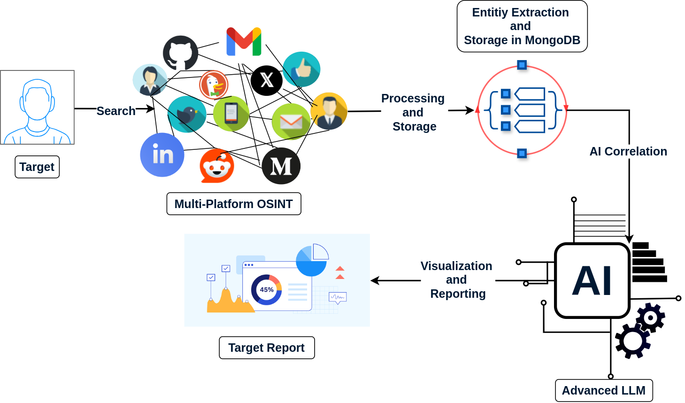
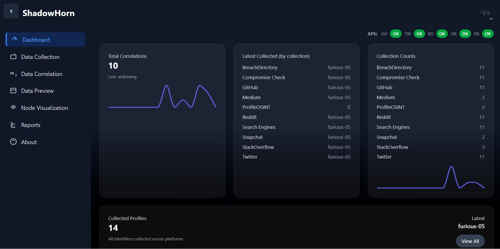
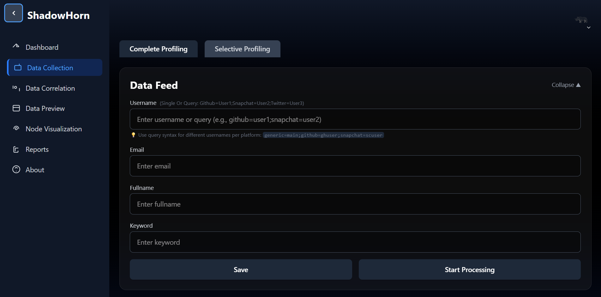
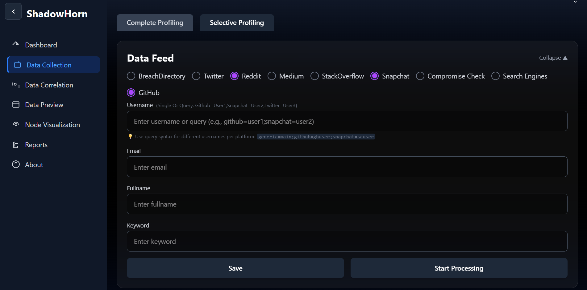
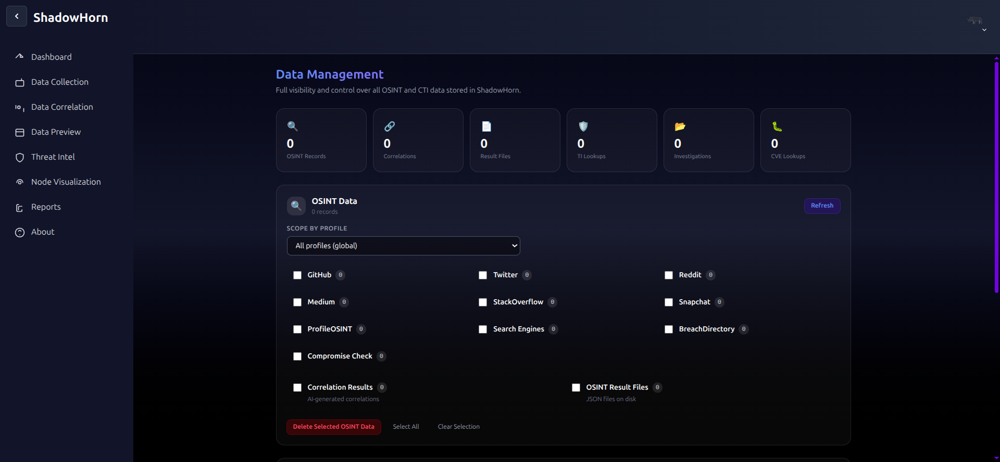
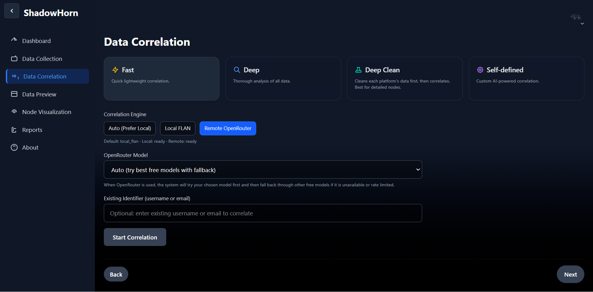
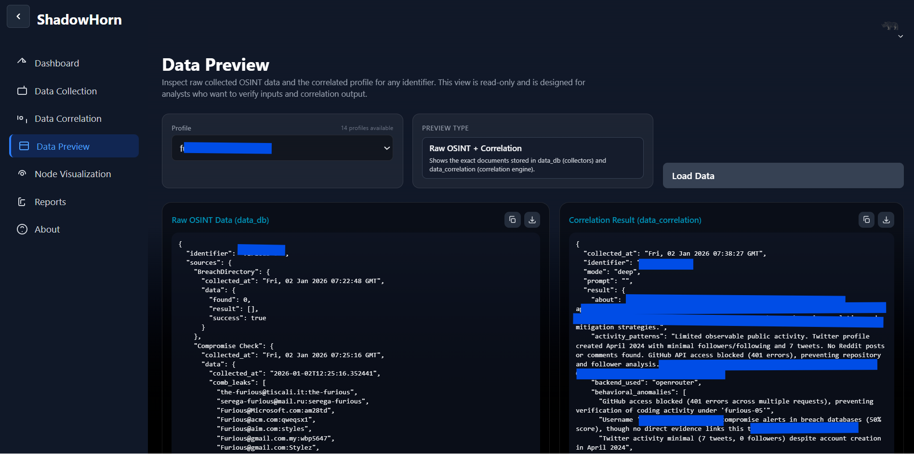
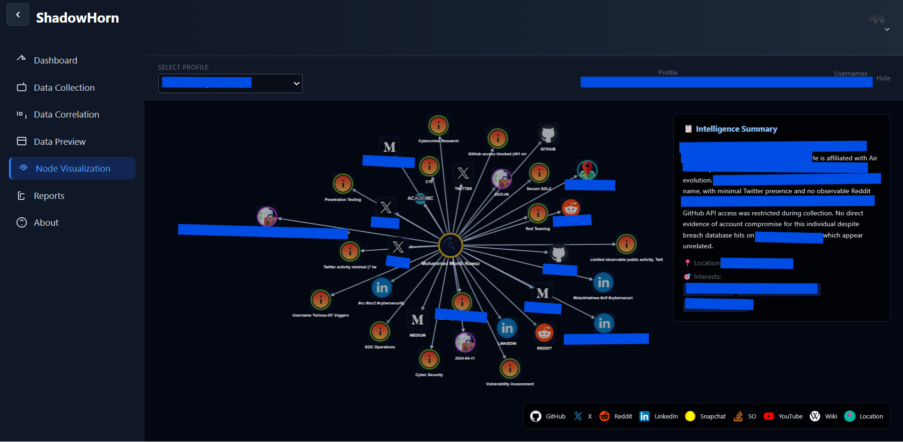
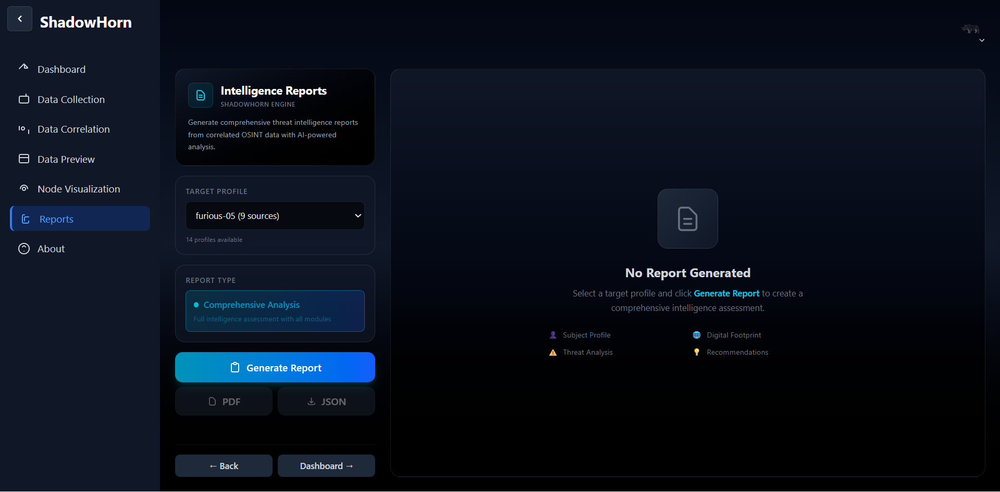
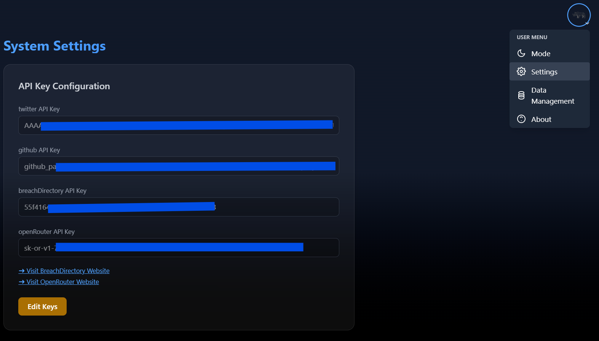

<div align="center">
  
  
  # ShadowHorn
  
  **Advanced Open Source Intelligence & Threat Analysis Platform**
  
  [](https://opensource.org/licenses/MIT)
  [](https://www.python.org/)
  [](https://react.dev/)
  [](https://vitejs.dev/)
  [](https://www.mongodb.com/)
  [](https://docs.docker.com/compose/)
  [](https://discord.gg/AxBskSe5Yb)

  <p align="center">
    <a href="#-about">About</a> •
    <a href="#-features">Features</a> •
    <a href="#-installation">Installation</a> •
    <a href="#-usage">Usage</a> •
    <a href="#-api-keys--free-tiers">API Keys</a> •
    <a href="#-contributing">Contributing</a> •
    <a href="#-community--support">Community</a>
  </p>
</div>

---

## 🛡️ About

**ShadowHorn** is a next-generation OSINT (Open Source Intelligence) platform designed for security researchers, investigators, and threat analysts. It combines powerful data collectors with correlation to uncover hidden connections across the digital landscape.

Built with a modern **React** frontend and a robust **Python Flask** backend, ShadowHorn provides a seamless experience for gathering, analyzing, and visualizing intelligence data from multiple sources including social media, code repositories, and breach databases.

ShadowHorn itself is completely free to use, and its core data collection and correlation pipeline is built around free‑tier APIs. You can go from first collection to correlation without paying for external services (optional breach‑directory lookups can use provider billing if you choose to enable them).

<div align="center" style="background:white; padding:12px; border-radius:8px; margin: 20px 0;">
  
</div>

<div align="center" style="margin: 24px 0;">
  <h3>▶️ Installation & Basic Usage Video</h3>
  <a href="https://www.youtube.com/watch?v=SGoNOTvT9C0" target="_blank">
    
  </a>
  <p>Click the image above to watch the installation and basic usage guide for ShadowHorn.</p>
</div>


### 🌐 Data Sources

ShadowHorn currently collects OSINT from:

<p align="center">
  
  
  
  
  
  
  
  
</p>

- **GitHub** – repositories, stars, followers, activity.
- **Twitter/X** – profile metadata and recent tweets.
- **Reddit** – posts, comments, and karma.
- **Medium** – articles and author profiles.
- **StackOverflow** – questions, answers, and reputation.
- **Snapchat** – public profile metadata.
- **Search Engines (DuckDuckGo)** – extra links and OSINT context.
- **BreachDirectory & Compromise Check** – breach indicators and credential exposure.

## 🚀 Features

ShadowHorn is organized into intuitive modules to streamline your intelligence workflow:

### 📊 Dashboard
The command center of your operations. View real-time system status, active collectors, database statistics, and recent activity logs. Get a high-level overview of your current investigation targets.



### 📡 Data Collection
A powerful suite of collectors to gather raw intelligence from a single subject (username / email / full name).

**What it collects**
- **Social Media**: Snapchat, Twitter/X, Reddit, LinkedIn.
- **Code Repositories**: GitHub user and repository analysis.
- **Search Engines**: DuckDuckGo and Google‑style dorks.
- **Breach Data**: Integration with breach directory and compromise‑check APIs.

**How to use it best**
- Use **Complete Profiling** when you want all platforms; use **Selective Profiling** when you only care about a few.
- If you only know a **username**, paste it into **Username**, and (optionally) reuse it in **Fullname** and **Keyword** so search engines and Medium have input.
- If you have email, full name, and keywords, fill **all fields** – collectors will use everything you provide.
- For different handles per platform, use query syntax in **Username**, e.g. `generic=main;github=ghuser;snapchat=scuser`.

*Collectors support multi‑threading and proxy‑friendly operation for stealthier runs.*

**Collection views**




### 💾 Data Management
Safely clean up stored OSINT data when an investigation is finished.
- **Targeted cleanup**: Remove collected OSINT, correlation results, and OSINT result files for a single profile by providing an identifier (email / username / profile key).
- **Scoped categories**: Choose which layers to wipe (MongoDB OSINT collections, correlation documents, and JSON files under `backend/osint_results`).
- **Global reset (protected)**: Use the "Clean all data" button and type `clean all data` to perform a full environment reset; this action is irreversible, so export any reports you need first.



### 🧠 Data Correlation
The brain of ShadowHorn.
- **Analysis**: Uses OpenRouter/OpenAI models or a local FLAN model to analyze patterns in collected data.
- **Identity Resolution**: Correlates usernames, emails, and aliases across different platforms.
- **Deep Clean Mode**: Advanced filtering to remove noise and false positives.

**Correlation models (via OpenRouter, configurable in Settings):**

| Model | Provider | Cost | Best For |
|-------|----------|------|----------|
| DeepSeek V3.1 Nex N1 | Nex AGI | Free | Agent workflows, coding, tooling |
| DeepSeek R1T2 Chimera | TNG | Free | Long-context deep reasoning |
| DeepSeek R1T Chimera | TNG | Free | Balanced general-purpose analysis |
| DeepSeek R1 0528 | DeepSeek | Free | High-reasoning with open chain-of-thought |
| gpt-oss-120b | OpenAI | Free | Heavy reasoning (MoE, H100-class) |
| gpt-oss-20b | OpenAI | Free | Lower-latency, single-GPU deployments |

These models are selectable in the UI on the Data Correlation page before running analysis. If you don't want to use OpenRouter at all, you can use the **local FLAN model** for offline correlation (see [Installation](#-installation)).



### 🔍 Data Preview
Lightweight viewer for what has been collected and correlated.
- Inspect raw OSINT JSON per platform.
- Inspect the correlation document that feeds Reports and Node Visualization.



### 🕸️ Node Visualization
Interactive graph visualization powered by Cytoscape.
- **Visual Links**: See connections between profiles, emails, and domains.
- **Platform Icons**: Visual indicators for Snapchat, Twitter, GitHub, etc.
- **Interactive Graph**: Drag, zoom, and explore the relationship network.
- **Styling**: Custom node styles for "Interest", "Timeline", and "Identity" nodes.



### 📝 Intelligence Reports
Generate professional-grade reports for stakeholders.
- **Automated Narratives**: Threat assessment and executive summaries.
- **Export**: Download as high-quality PDF or JSON.
- **Risk Scoring**: Automated risk level assessment based on findings.


### ⚙️ Settings
Configure your environment.
- **API Keys**: Manage keys for OpenRouter, Twitter, GitHub, and BreachDirectory.
- **Theme**: Toggle between dark and light themes.



---

## 🔑 API Keys & Free Tiers

ShadowHorn is designed to run on free API tiers where possible. Only BreachDirectory requires a paid subscription.

| API | Cost | Required? | What It Does |
|-----|------|-----------|-------------|
| **GitHub** | Free | Recommended | Collect repositories, stars, followers, activity |
| **Twitter/X** | Free tier | Optional | Read public tweets and profile metadata |
| **OpenRouter** | Free tier | Recommended | Correlation and report narratives (6 free models) |
| **BreachDirectory** | Paid (RapidAPI) | Optional | Breach lookups and credential exposure checks |

**How to get each key:**

- **GitHub**: Sign in to GitHub → **Settings → Developer settings → Personal access tokens** → create a token (read-only scope is enough).
- **Twitter/X**: Visit [developer.twitter.com](https://developer.twitter.com) → create a **Project & App** → copy the **Bearer Token** from Keys & Tokens tab.
- **OpenRouter**: Go to [openrouter.ai](https://openrouter.ai) → sign in → **API Keys** → create a new key. Video walkthrough: [youtu.be/Azkyhcxc1cE](https://youtu.be/Azkyhcxc1cE?si=uhW1wIuEiNxEW_c6).
- **BreachDirectory**: Open the BreachDirectory listing on [RapidAPI](https://rapidapi.com/rohan-patra/api/breachdirectory) → subscribe to a plan → copy your **X-RapidAPI-Key**.

All keys are configured from **Settings → API Key Configuration** in the UI and stored in MongoDB.

---

## 💻 Installation

### Docker (Recommended)

The easiest way to run ShadowHorn. Three containers: frontend (Nginx), backend (Flask/Gunicorn), and MongoDB.

**Prerequisites:** [Docker](https://docs.docker.com/get-docker/) and [Docker Compose](https://docs.docker.com/compose/install/)

#### Standard Build (OpenRouter only)

```bash
git clone https://github.com/furious-05/ShadowHorn.git
cd ShadowHorn
docker compose build
docker compose up -d
```

Open `http://localhost:8080` in your browser.

#### Build with Local FLAN (offline correlation)

Includes `torch`, `transformers`, and `sentence-transformers` for local model inference without needing OpenRouter.

```bash
git clone https://github.com/furious-05/ShadowHorn.git
cd ShadowHorn
INSTALL_LOCAL_AI=true docker compose build --no-cache
GUNICORN_WORKERS=1 GUNICORN_TIMEOUT=600 docker compose up -d
```

> **Note:** Local FLAN uses a single gunicorn worker (`GUNICORN_WORKERS=1`) to avoid duplicate model loading in memory. CPU inference can be slow (30–60+ seconds per correlation).

#### Image Sizes

| Build | Frontend | Backend | MongoDB | Total |
|-------|----------|---------|---------|-------|
| Standard (OpenRouter only) | ~73 MB | ~403 MB | ~878 MB | ~1.35 GB |
| With Local FLAN | ~73 MB | ~5.6 GB | ~878 MB | ~6.55 GB |

#### Add Local FLAN Later

If you already built without local FLAN and want to add it later without rebuilding:

```bash
docker compose exec backend pip install -r requirements-local-ai.txt
```

This installs into the running container. To make it permanent, rebuild with `INSTALL_LOCAL_AI=true`.

#### Useful Docker Commands

| Command | Effect |
|---------|--------|
| `docker compose up -d` | Start all services |
| `docker compose down` | Stop all services (keeps data) |
| `docker compose down -v` | Stop all services **and wipe database** |
| `docker compose logs backend --tail=50` | View backend logs |
| `docker image prune -f` | Remove dangling build layers |

---

### Manual Installation

For development or when you prefer running services individually.

**Prerequisites:**
- Python 3.13+
- Node.js 22+
- MongoDB 7 (local or Atlas)
- Git

#### Windows

```powershell
git clone https://github.com/furious-05/ShadowHorn.git
cd ShadowHorn

# Backend
cd backend
python -m venv venv
.\venv\Scripts\Activate
pip install -r requirements.txt
# Optional: pip install -r requirements-local-ai.txt

# Frontend (new terminal, from project root)
cd ..
npm install
```

#### Linux / macOS

```bash
git clone https://github.com/furious-05/ShadowHorn.git
cd ShadowHorn

# Backend
cd backend
python3 -m venv venv
source venv/bin/activate
pip install -r requirements.txt
# Optional: pip install -r requirements-local-ai.txt

# Frontend (new terminal, from project root)
cd ..
npm install
```

---

## 🕹️ Usage

### Docker

After `docker compose up -d`, open `http://localhost:8080`.

**Default credentials:** `shadowhorn` / `ShadowHorn@2026`

On first login you will be prompted to set a new password.

### Manual

Start the backend and frontend in separate terminals:

**Backend:**
```bash
cd backend
source venv/bin/activate   # Windows: .\venv\Scripts\Activate
python app.py
```

**Frontend:**
```bash
npm run dev
```

Open `http://localhost:5173`. On first launch, go to **Settings → API Key Configuration** to enter your API keys.

---

## 🧭 Page‑by‑Page Walkthrough

### 1. Login
- Open the application URL and sign in.
- Default credentials: `shadowhorn` / `ShadowHorn@2026` (forced password change on first login).
- After authentication, the session is maintained via JWT in the browser.

### 2. Dashboard
- Shows overall health of the collectors and backend (API status pills for GitHub, Twitter, etc.).
- Displays quick metrics: total correlations, collections, profiles, recent activity, and 14‑day trend chart.
- Use the **Next** button to move into **Data Collection** once your APIs show as **OK**.

### 3. Settings
- Open **Settings** before your first run and fill API keys (Twitter, GitHub, BreachDirectory, OpenRouter).
- Click **Save Keys** to store them in MongoDB.
- You can edit and re-save keys later if needed.

### 4. Data Collection
This is where you gather OSINT for a single subject.

- Choose a **tab**:
  - **Complete Profiling** – enables all platforms by default.
  - **Selective Profiling** – lets you toggle individual platforms.
- Fill at least one of: **Username**, **Email**, or **Full Name**.
- Click **Start Processing**. A progress modal shows which platform is running.
- When finished, data is stored in MongoDB and `backend/osint_results`.

**Query formats:**
- **Simple**: just type a value, e.g. `furious-05` — reused across all platforms.
- **Per-platform**: use `platform=username` pairs separated by `;`, e.g. `generic=furious-05;snapchat=furious.snap;reddit=furiousR`.

**Recommended input pattern:**
- If you only know a **username**, paste it into Username, Fullname, and Keyword so search-engine and Medium collectors have input.
- If you know more (email, full name, keywords), fill **all fields** for richer results.

### 5. Data Correlation
Turns raw OSINT into a unified intelligence profile.

- Pick an **Existing Identifier** (the profile you collected earlier).
- Choose **Correlation Mode**:
  - **Fast** – quick summary using less context.
  - **Deep** – full context across all platforms (recommended for final reports).
  - **Deep Clean** – cleans each platform's data individually before correlating.
  - **Self-defined** – custom prompt to steer the analysis.
- Choose **Engine**: `Auto`, `Local FLAN`, or `OpenRouter`.
- Choose a specific **OpenRouter Model** or leave on Auto.
- Click **Start Correlation**.

**Best practice:** Always verify that Data Collection has run recently for the identifier. Use Deep mode for final investigations; Fast for quick triage.

### 6. Node Visualization
Graph view of the correlated profile.

- Select a profile from the dropdown.
- **Pan/Zoom** with mouse or trackpad.
- **Click a node** to open the Node Details panel showing platform, handle, bio, metrics, and links.
- The Intelligence Summary panel displays the correlation narrative.

### 7. Data Preview
- Inspect raw **OSINT JSON** and **correlation documents** for a chosen identifier.
- Pick an identifier, click **Load Data** to view formatted JSON.
- Useful for debugging collectors and verifying correlation input.

### 8. Intelligence Reports
Produces professional reports for stakeholders.

- Select an identifier from the dropdown.
- Click **Generate Report**. Backend assembles sections: Overview, Attack Surface, Breach Findings, Timeline, and Recommendations.
- Browse sections in the UI or click **Download PDF** for a shareable report.

### 9. Data Management
Controls cleanup of stored data.

- Choose what to clean: Collected OSINT, Correlation results, or OSINT result files.
- Enter an **Identifier** to target a specific profile, or use **Clean all data** for a full reset.
- Targeted cleanup requires an identifier — it won't delete everything if no identifier is provided.

### 10. About
- Overview of ShadowHorn's purpose, capabilities, workflow, and tech stack.

---

## 🛠️ Troubleshooting

**GitHub collector shows 401 errors**

```json
"GitHub": {
  "warnings": ["Request failed: 401", ...]
}
```

Your GitHub token is invalid or expired. Generate a new one at GitHub → **Settings → Developer settings → Personal access tokens** with `repo` and `read:user` scopes, then update it in ShadowHorn Settings.

**OpenRouter correlation fails**

- Verify your OpenRouter API key at [openrouter.ai](https://openrouter.ai).
- Keys don't expire automatically, but can be revoked. If correlation fails with auth errors, re-check the key in Settings.

**Twitter shows "client-not-enrolled"**

Your Twitter Developer App must be attached to a **Project** in the [Twitter Developer Portal](https://developer.twitter.com). Create a project, attach your app to it, and the error will resolve.

**Local FLAN OOM (Out of Memory)**

If the backend worker gets killed during local FLAN correlation, you're running out of memory. Ensure `GUNICORN_WORKERS=1` is set (prevents duplicate model loading). The machine needs at least 4 GB free RAM for `flan-t5-small`.

**Still logged in after rebuild**

Docker volumes persist your database across container/image rebuilds. Use `docker compose down -v` to wipe the database and force a fresh start with default credentials.

---

## 🤝 Contributing

Contributions are very welcome.

- **Issues**: Use GitHub Issues to report bugs, suggest new collectors, or request UX improvements.
- **Pull Requests**:
  - Fork the repo and create a feature branch.
  - Keep changes focused (one feature or fix per PR).
  - Run the backend and frontend locally to test your change.
- **Docs & Examples**: Improvements to this README, screenshots, and usage tips are also valuable contributions.

Before starting a large feature, consider opening an issue first so ideas can be discussed and aligned.

---

## 💬 Community & Support

Join the **Shadow HNR** community on Discord to discuss OSINT tactics, request features, or get support.

<a href="https://discord.gg/AxBskSe5Yb">
  
</a>

- **#installation-help**: Get help setting up the tool.
- **#feature-requests**: Suggest new collectors or features.
- **#general-chat**: Discuss OSINT and Cyber Intelligence.

---

## ⚖️ License

Distributed under the MIT License. See `LICENSE` for more information.

---

## ⚠️ Disclaimer

**ShadowHorn is for educational and authorized research purposes only.**
The developers assume no liability and are not responsible for any misuse or damage caused by this program. Users are responsible for ensuring their activities comply with all applicable local, state, and federal laws.

---

<div align="center">
  <sub>Built with 💻 and ☕ by the Shadow HNR Team</sub>
</div>
